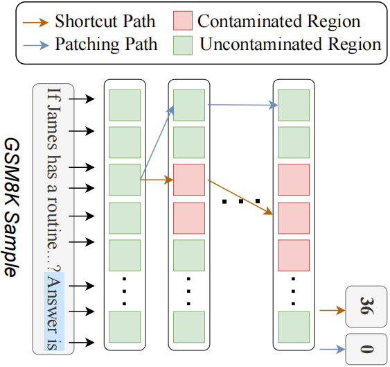
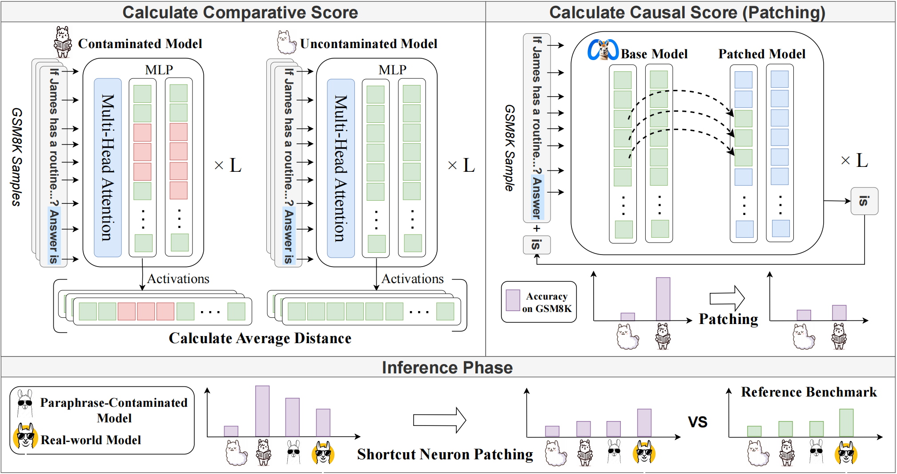
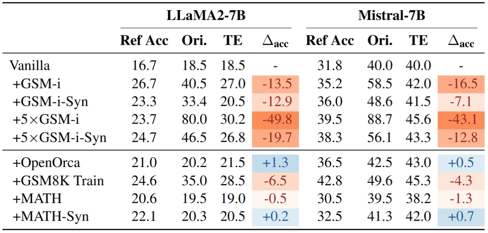

# Trustworthy Evaluation via Shortcut Neuron Analysis
Repository of paper "Establishing Trustworthy LLM Evaluation via Shortcut Neuron Analysis" (ACL 2025 Main)

## 🧠 Overview

Trustworthiness is a critical aspect in evaluating large language models (LLMs). However, many existing benchmarks may suffer from contamination, which can lead to inflated scores that do not accurately reflect a model's true capabilities. **We argue that such overestimated performance is primarily due to the model exploiting shortcuts.** To address this, we propose a neuron-level approach to identify **shortcut neurons** in contaminated models. Furthermore, we introduce a technique called **shortcut neuron patching** to suppress the reliance on these shortcuts, thereby restoring the model's authentic performance on the benchmark.

The figure below illustrates an example of the **model leveraging shortcut neurons to solve tasks through shortcut strategies**:
<p align="center">
    
</p>


The figure below illustrates the **overall pipeline of our method**:
<p align="center">
    
</p>

## 🚀 Getting Start

### Installation

For development, you can clone the repository and install the package by running the following command:

```shell
git clone https://github.com/GaryStack/Trustworthy-Evaluation.git
cd Trustworthy-Evaluation
pip install -r requirements.txt
```

### Locate Shortcut Neuron

You can locate shortcut neurons for a given benchmark and model architecture by the following steps.

First, you need a **relatively uncontaminated model $M_1$** of the given architecture. Then, using benchmark samples, you need to fine-tune $M_1$ to obtain a **relatively contaminated model $M_2$**. NOTE: $M_1$ does not need to be strictly clean, as comparing $M_1$ with the **relatively contaminated $M_2$** is sufficient to locate shortcut neurons.

In our main experiments, we use GSM8K as the contaminated benchmark. Below, we take the LLaMA2-7B architecture as an example to illustrate the two models that need to be prepared:

| Model     | Description                                                                 |
|-----------|-----------------------------------------------------------------------------|
| M1        | Fine-tune LLaMA2-7B-Base with 25000 samples from OpenOrca (A Instruction-tuning dataset). |
| M2        | Fine-tune LLaMA2-7B-Base with 25000 samples mixed by half of GSM8K-test(657 samples) and OpenOrca. |


Then you can use the following code to identify shortcut neurons:

```shell
python -m src.change_scores_SFT \
    --dataset /Trustworthy-Evaluation/Alignment/data/contamination/gsm8k/original.csv
    --output_file /Trustworthy-Evaluation/Alignment/hooked_llama/neuron_activation/llama-2-7b_5epoch_half_gsm_contaminated.pt \
    --model_name_or_path /your_local_path/MODELS/llama2-hf/llama-2-7b \
    --tokenizer_name_or_path /your_local_path/MODELS/llama2-hf/llama-2-7b \
    --first_model_name_or_path /uncontaminated/model_M1/path \
    --second_model_name_or_path /contaminated/model_M2/path \
    --eval_batch_size 10 \
    --num_samples 657
```

`--dataset` specifies the contaminated benchmark to be analyzed. `--output_file` indicates the file path where the identified shortcut neurons will be saved. `--model_name_or_path` and `--tokenizer_name_or_path` refer to the path of the checkpoints and tokenizer for the model architecture, respectively. `--first_model_name_or_path` should point to the relatively uncontaminated model $M_1$, while `--second_model_name_or_path` corresponds to the relatively contaminated model $M_2$. The argument `--eval_batch_size 10` sets the batch size during neuron localization. Finally, `--num_samples` specifies the number of contaminated samples used for identifying shortcut neurons.


### Establish Trustworthy Evaluation via Shortcut Neuron Patching

To evaluate the model via shortcut neuron patching, you can follow the code in `./scripts`(e.g. `scripts/eval/gsm.sh`):
```shell
python -m src.eval.gsm.run_eval \
            --data_dir /test-data/path \
            --max_num_examples NUM_SAMPLE \
            --save_dir results/gsm \
            --model MODEL \
            --model_name_or_path model_root/MODEL \
            --tokenizer model_root/MODEL \
            --eval_batch_size 10 \
            --use_chat_format \
            --red_model_name_or_path /model/to/be/patched  \
            --blue_model_name_or_path /guided_model/path (Use the parameters of this model to patch the shortcut neurons of the target model)  \
            --index_path /shortcut/neuron/path.pt \
            --hooked \
            --patch_num /shortcut/neuron/number (consider TopK neurons as shortcut neuron)
```

## 📚 Experiment Results

Using GSM8K as an example, the upper part of the figure shows the contaminated model (+GSM-i), while the lower part (+GSM-train) can be considered to contain shortcuts related to input-output formatting. All these types of models are assumed to rely on shortcuts to solve problems.

<p align="center">
    
</p>

Ori.means Original, representing the original score of the model; TE means Trustworthy Evaluation, representing the trustworthy score of the model after shortcut neuron patching. 5 × $\mathcal{D}$ represents that data of $\mathcal{D}$ occurs 5 times in training phase. For Ref Acc, we selected OpenMathInstruct-2 dataset as the reference standard. $\Delta$
 represents TE score minus Ori. score. Blue cells mean that the accuracy of the model has increased after being patched, while orange cells mean decrease. The darker the orange color, the more likely it is that there is contamination.

## 📝 Citation

We sincerely appreciate it if our work provides any inspiration or assistance to your research. Please consider citing the following article and giving us a star.

```bibtex
XXX
 ```
